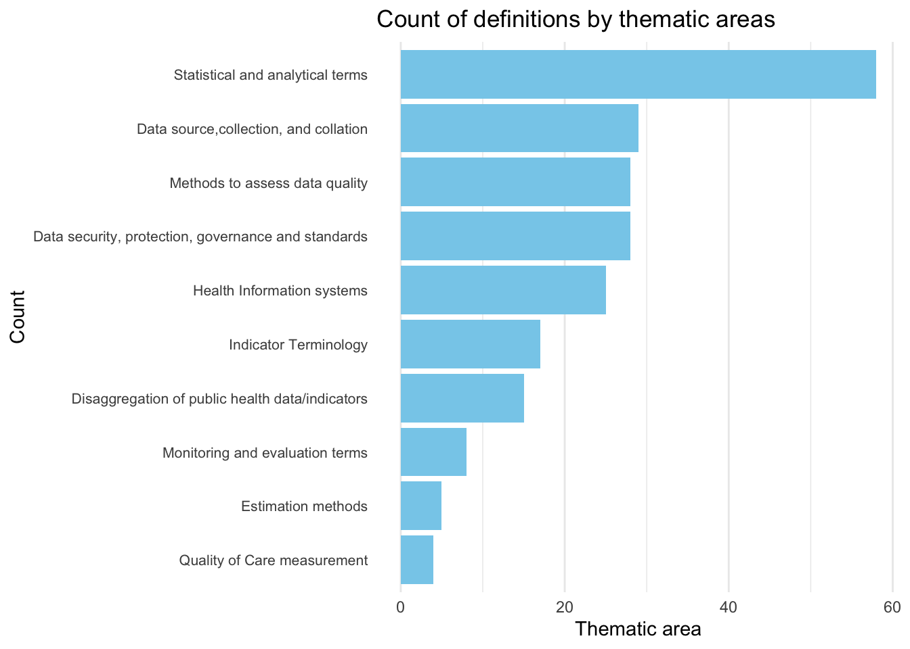
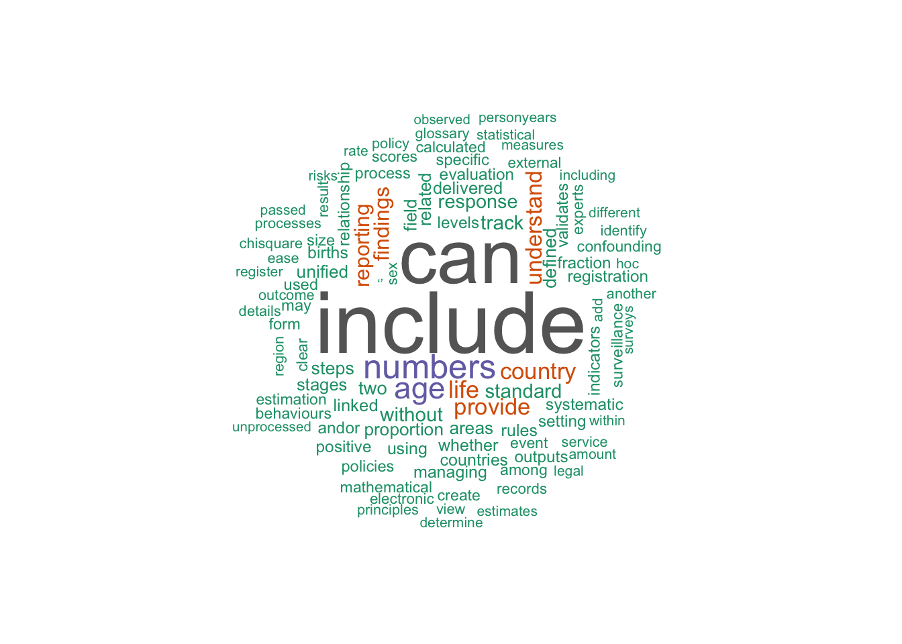

# glossarywho

[](https://zenodo.org/doi/10.5281/zenodo.14754016)
[](https://github.com/openwashdata/glossarywho/actions/workflows/R-CMD-check.yaml)

The goal of glossarywho is to provide data from the [WHO
Glossary](https://www.who.int/publications/i/item/9789240105485) in a
tidy format. Access definitions by themes
[here](https://openwashdata.github.io/glossarywho/articles/Themes.html)
or use the search bar at the top of the page.

## Installation

You can install the development version of glossarywho from
[GitHub](https://github.com/) with:

``` r

# install.packages("devtools")
devtools::install_github("openwashdata/glossarywho")
```

``` r

## Run the following code in console if you don't have the packages
## install.packages(c("dplyr", "knitr", "readr", "stringr", "gt", "kableExtra"))
library(dplyr)
library(knitr)
library(readr)
library(stringr)
library(gt)
library(kableExtra)
```

Alternatively, you can download the individual datasets as a CSV or XLSX
file from the table below.

1.  Click Download CSV. A window opens that displays the CSV in your
    browser.
2.  Right-click anywhere inside the window and select “Save Page As…”.
3.  Save the file in a folder of your choice.

| dataset | CSV | XLSX |
|:---|:---|:---|
| definitions | [Download CSV](https://github.com/openwashdata/glossarywho/raw/main/inst/extdata/definitions.csv) | [Download XLSX](https://github.com/openwashdata/glossarywho/raw/main/inst/extdata/definitions.xlsx) |
| themes | [Download CSV](https://github.com/openwashdata/glossarywho/raw/main/inst/extdata/themes.csv) | [Download XLSX](https://github.com/openwashdata/glossarywho/raw/main/inst/extdata/themes.xlsx) |

## Data

The package provides access to glossary terms, definitions and thematic
areas from the WHO Glossary. The datasets are: themes and definitions.

``` r

library(glossarywho)
```

### definitions

The dataset `definitions` contains data about definitions from the WHO
glossary It has 207 observations and 2 variables

``` r

definitions |> 
  head(3) |> 
  gt::gt() |>
  gt::as_raw_html()
```

| Term | Description |
|:---|:---|
| Accountability | Answerability or legal responsibility for identifying and removing obstacles and barriers to health services. This should include responding to findings from monitoring and evaluation (1). |
| Accuracy | The degree to which a measurement, test or procedure correctly reflect the true value or condition (2). |
| Delineated geographical areas within | a particular territory created for the purpose of administration. For example: county, district, province, state, region, subnational or national (3). |

### themes

The dataset `themes` contains data about thematic areas from the WHO
glossary. It has 217 observations and 2 variables

``` r

themes |> 
  head(3) |> 
  gt::gt() |>
  gt::as_raw_html()
```

| Thematic Area                         | Term               |
|:--------------------------------------|:-------------------|
| Data source,collection, and collation | Data accessibility |
| Data source,collection, and collation | Data type          |
| Data source,collection, and collation | Primary data       |

For an overview of the variable names, see the following table.

| variable_name | variable_type | description             |
|:--------------|:--------------|:------------------------|
| Term          | character     | Term in the Glossary    |
| Description   | character     | Description of the term |

## Example

``` r

library(glossarywho)
library(ggplot2)
library(tidyverse)
# Plot a bar chart of count of definitions by thematic areas 
themes |> 
  count(`Thematic Area`) |> 
  ggplot2::ggplot(aes(x = fct_reorder(`Thematic Area`, n), y = n)) +
  geom_col(fill = "skyblue") +
  coord_flip() +
  labs(title = "Count of definitions by thematic areas",
       x = "Count",
       y = "Thematic area") +
  theme_minimal() +
  theme(axis.text.y = element_text(size = 8)) +
  theme(panel.grid.major.y = element_blank(),
         panel.grid.minor.y = element_blank())
```



``` r

# Wordcloud of most common words from definitions
library(wordcloud)
library(tm)

# Create a corpus
corpus <- Corpus(VectorSource(definitions$Description))

# Clean the corpus
corpus <- tm_map(corpus, content_transformer(tolower))
corpus <- tm_map(corpus, removePunctuation)
corpus <- tm_map(corpus, removeNumbers)
corpus <- tm_map(corpus, removeWords, stopwords("en"))
corpus <- tm_map(corpus, stripWhitespace)

# Create a document term matrix
dtm <- DocumentTermMatrix(corpus)

# Create a wordcloud
wordcloud(words = names(sort(colSums(as.matrix(dtm)), decreasing = TRUE)),
          freq = colSums(as.matrix(dtm)),
          min.freq = 1,
          max.words = 100,
          random.order = FALSE,
          colors = brewer.pal(8, "Dark2"))
```



## License

Data are available as
[CC-BY](https://github.com/openwashdata/glossarywho/blob/main/LICENSE.md).

## Citation

Please cite this package using:

``` r

citation("glossarywho")
#> To cite package 'glossarywho' in publications use:
#> 
#>   Dubey Y (2025). "glossarywho: WHO Glossary."
#>   doi:10.5281/zenodo.14754016
#>   <https://doi.org/10.5281/zenodo.14754016>.
#>   <https://openwashdata.github.io/glossarywho/>.
#> 
#> A BibTeX entry for LaTeX users is
#> 
#>   @Misc{dubey:2025,
#>     title = {glossarywho: WHO Glossary},
#>     author = {Yash Dubey},
#>     year = {2025},
#>     doi = {10.5281/zenodo.14754016},
#>     url = {https://openwashdata.github.io/glossarywho/},
#>     abstract = {This package provides access to a tidy version of the WHO Glossary (https://www.who.int/publications/i/item/9789240105485) and thematic areas for each term.},
#>     keywords = {open data,washdata,glossary,health data,health statistics,public health indicators,data governance,WHO},
#>     version = {1.0.2},
#>   }
```
